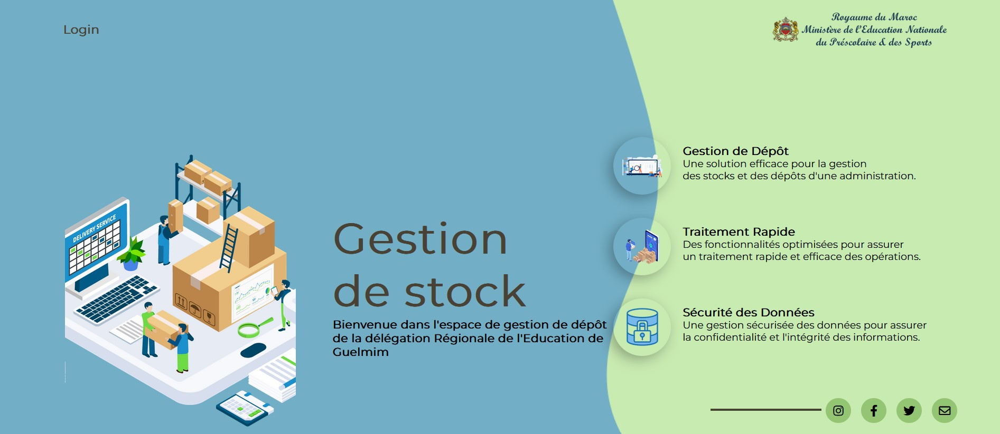

# Gestion de Dépôt 

Ce projet est une application de gestion de stock pour l'administration de la Délégation Régionale de l'Education de Guelmim. Il permet de suivre et gérer les stocks de différents produits dans le dépôt.

## Fonctionnalités

- Enregistrer les entrées et sorties de produits dans le stock du matériel
- Consulter les produits disponibles et leur quantité
- Générer des rapports et des statistiques à propos du stock
- Gérer les fournisseurs et les bénéficiaires
- ...

## Captures d'écran
Page d'accueil

Dashboard

Liste des produits

Ajouter un nouveau fournisseur


## Installation

1. Clonez ce dépôt sur votre machine locale.
2. Assurez-vous que vous avez PHP, Composer et MySQL installés sur votre machine.
3. Copiez le fichier `.env.example` et renommez-le en `.env`. Configurez les informations de la base de données.
4. Exécutez les commandes suivantes pour installer les dépendances et configurer l'application :
    ```shell
    composer install
    php artisan key:generate
    php artisan migrate
    php artisan db:seed
    ```
5. Lancez le serveur de développement :
    ```shell
    php artisan serve
    ```
6. Accédez à l'application dans votre navigateur à l'adresse `http://localhost:8000`.

## Contribution

Toute contribution à ce projet est la bienvenue ! Si vous souhaitez apporter des améliorations, veuillez suivre ces étapes :

1. Fork ce dépôt
2. Créez une nouvelle branche (`git checkout -b feature/your-feature`)
3. Faites vos modifications
4. Commitez vos changements (`git commit -m 'Add some feature'`)
5. Poussez la branche (`git push origin feature/your-feature`)
6. Ouvrez une pull request

## Auteurs

- ELBAYYADI AMINA [@aminaelbayyadi](https://github.com/aminaelbayyadi)
- BOUTOUMIT EL MEHDI [@mehdiboutoumit](https://github.com/mehdiboutoumit)


